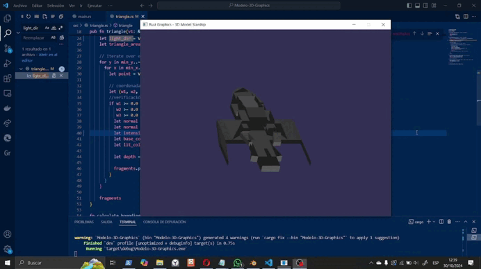

# Modelo-3D-Graphics
Este proyecto implementa un renderizador 3D básico en Rust que permite visualizar y manipular un modelo 3D de una nave espacial. El programa utiliza técnicas de computación gráfica fundamentales como transformaciones geométricas, manejo de cámara y renderizado con iluminación básica.

## Descripción
El proyecto implementa un pipeline gráfico simple que permite cargar y visualizar modelos 3D en formato .obj. Se creó específicamente para trabajar con un modelo de nave espacial diseñado en Blender, empleando herramientas básicas de modelado para mantener la simplicidad del objeto.

### Características Principales
- Carga de modelos 3D en formato .obj
- Sistema de transformaciones 3D (rotación, traslación, escala)
- Renderizado con iluminación básica  
- Control interactivo del modelo y la cámara
- Framebuffer personalizado para el renderizado
- Implementación de z-buffer para manejo correcto de profundidad

### Controles
- **Flechas direccionales**: Mover el objeto en el espacio
- **S/A**: Aumentar/Disminuir escala del objeto
- **Q/W**: Rotar en eje X
- **E/R**: Rotar en eje Y  
- **T/Y**: Rotar en eje Z
- **ESC**: Salir del programa

## Requisitos Técnicos
- Rust (última versión estable)
- Dependencias (especificadas en Cargo.toml):
 - minifb: "0.27.0"
 - nalgebra-glm: "0.19.0" 
 - tobj: "4.0.2"

## Instalación y Uso
Para ejecutar el programa, sigue estos pasos:

```bash
# Clonar el repositorio
git clone https://github.com/Maria-Villafuerte/Modelo-3D-Graphics.git

# Entrar al directorio  
cd Modelo-3D-Graphics

# Compilar el proyecto
cargo build

# Ejecutar el programa
cargo run
```

## Estructura del Proyecto
```bash
Modelo-3D-Graphics/
├── src/
│   ├── main.rs           # Punto de entrada y lógica principal
│   ├── framebuffer.rs    # Manejo del framebuffer
│   ├── triangle.rs       # Renderizado de triángulos
│   ├── vertex.rs         # Definición de vértices  
│   ├── obj.rs           # Carga de modelos .obj
│   └── shaders.rs       # Shaders básicos
├── assets/
│   └── Navesita.obj     # Modelo 3D de la nave
└── README.md

```

## Modelo 3D
El modelo de la nave espacial fue creado en Blender utilizando únicamente las siguientes herramientas básicas:
- Move
- Scale
- Rotate
- Extrude
- Inset
- Bevel
- Knife y subdivide

## Demo

Aquí puedes ver una demostración en funcionamiento:




